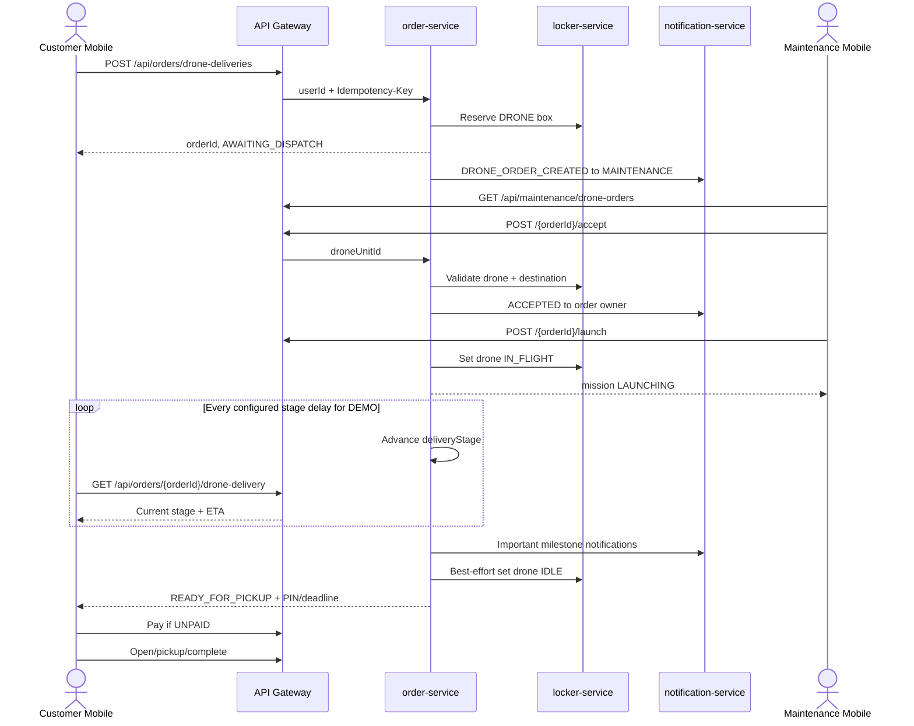

# Drone Delivery Demo Workflow

Tài liệu này là contract review chung cho backend và mobile của luồng giao hàng bằng drone. Luồng demo dùng cùng `orderId`, order, mission và API với hướng production; phần phần cứng được thay bằng scheduler mô phỏng stage.

## 1. Phạm Vi Hiện Tại

Đã có:

- Customer tạo một order thật `type=DRONE_DELIVERY` và chọn locker/ô DRONE đích.
- MAINTENANCE xem queue theo `orderId`, tiếp nhận, gán drone và phát lệnh phóng.
- Backend tự tiến stage của order DEMO theo thời gian cấu hình.
- Customer poll read model theo `orderId` và xem timeline 8 mốc.
- Notification tới MAINTENANCE khi có đơn mới và tới customer ở các mốc quan trọng.
- Đơn có thể được tiếp nhận/phóng khi chưa thanh toán; payment chỉ bắt buộc trước pickup/mở tủ.

Chưa có:

- MAVLink mission upload, ArduPilot/PX4, telemetry hoặc GPS thật.
- Live map thật và tọa độ di chuyển.
- Landing-pad, door, parcel-present hoặc weight sensor thật.
- Tự động mở tủ khi drone đến.
- Xác nhận vật lý việc thả kiện hàng.

## 2. Nguyên Tắc Dữ Liệu

Toàn bộ flow dùng một public identifier là `orderId`.

| Dữ liệu | Chủ sở hữu | Ý nghĩa |
|---|---|---|
| `LockerOrder` | `order-service` | Nghiệp vụ customer, payment, locker/box, PIN, pickup, completion |
| `DroneMission` | `order-service` trong slice hiện tại | Drone được gán, source/destination, mission status |
| Drone fleet | `locker-service` | Drone IDLE/IN_FLIGHT, pin, active status |
| Notification | `notification-service` | Lưu notification và gửi FCM |
| Timeline mobile | Mobile `features/drone_delivery` | Read-only; không tự tạo stage hay ID local |

Ba loại trạng thái không được dùng thay thế lẫn nhau:

| Trường | Ví dụ | Mục đích |
|---|---|---|
| `order.status` | `AWAITING_DISPATCH`, `STORING`, `COMPLETED` | Vòng đời nghiệp vụ order/pickup |
| `order.deliveryStage` | `ACCEPTED`, `EN_ROUTE`, `READY_FOR_PICKUP` | Mốc hiển thị cho customer và maintenance |
| `mission.status` | `READY_TO_LAUNCH`, `LAUNCHING`, `DEPOSITED` | Trạng thái kỹ thuật của mission |

## 3. DEMO Và STANDARD

`fulfillmentMode` được lưu trên từng order:

- `DEMO`: dùng source locker cấu hình; destination chỉ cần `ACTIVE`; scheduler mô phỏng chuyến bay.
- `STANDARD`: source lấy từ drone được gán; destination phải `ACTIVE`, có landing pad và `landingPadStatus=OK`; không được simulator tự tiến stage.

Quyền tạo DEMO do backend quyết định trước khi reserve ô:

| Biến môi trường | Mặc định | Ý nghĩa |
|---|---:|---|
| `APP_DRONE_DEMO_ENABLED` | `true` | Bật/tắt khả năng tạo order DEMO |
| `APP_DRONE_DEMO_ALLOWED_USER_IDS` | rỗng | Danh sách user ID cách nhau bằng dấu phẩy; rỗng nghĩa là cho mọi authenticated user khi DEMO đang bật |
| `APP_DRONE_DEMO_SOURCE_LOCKER_ID` | `1` | Locker/trạm nguồn cố định của demo |
| `APP_DRONE_DEMO_STAGE_DELAY_MS` | `7000` | Thời gian tối thiểu giữa hai stage demo |
| `APP_DRONE_DEMO_SCHEDULER_DELAY_MS` | `1000` | Chu kỳ scheduler kiểm tra mission |

Quy tắc resolve mode:

1. Client gửi `STANDARD`: luôn dùng STANDARD.
2. Client gửi `DEMO`: chỉ chấp nhận khi feature bật và user nằm trong allowlist.
3. Client không gửi mode: dùng DEMO nếu user được phép, ngược lại tự về STANDARD.
4. Mode không hợp lệ trả `DRONE_FULFILLMENT_MODE_INVALID`.
5. Yêu cầu DEMO trái quyền trả `DRONE_DEMO_NOT_ALLOWED` trước khi reserve box.

Khuyến nghị VPS/production: đặt allowlist rõ ràng hoặc `APP_DRONE_DEMO_ENABLED=false`; không để allowlist rỗng nếu không muốn mọi customer dùng demo.

## 4. State Machine

### Customer timeline

```text
AWAITING_DISPATCH
  -> ACCEPTED
  -> LAUNCHING
  -> DEPARTED
  -> EN_ROUTE
  -> APPROACHING
  -> ARRIVED
  -> READY_FOR_PICKUP
```

### Mission state

```text
READY_TO_LAUNCH
  -> LAUNCHING
  -> DEPARTED
  -> EN_ROUTE
  -> APPROACHING
  -> ARRIVED
  -> DEPOSITED
```

Khi kết thúc simulator:

- `mission.status = DEPOSITED`
- `order.status = STORING`
- `order.deliveryStage = READY_FOR_PICKUP`
- Backend sinh PIN 6 chữ số.
- `pickupDeadline = now + 24 giờ`.
- Backend best-effort đổi drone từ `IN_FLIGHT` về `IDLE`.
- Lỗi notification hoặc đồng bộ fleet không rollback kiện hàng đã chuyển sang pickup-ready.

## 5. Workflow End-To-End



## 6. Backend API Contract

Tất cả client API đi qua API Gateway. Mobile chỉ gửi `Authorization`; gateway inject `X-User-Id`.

### 6.1 Customer tạo order

```http
POST /api/orders/drone-deliveries
Authorization: Bearer <access-token>
Idempotency-Key: drone-<unique-client-key>
Content-Type: application/json
```

```json
{
  "destinationLockerId": 5,
  "preferredBoxId": 9001,
  "description": "Tài liệu cần giao",
  "parcelWeightGrams": 1200,
  "paymentMethod": "CASH",
  "fulfillmentMode": "DEMO"
}
```

`fulfillmentMode` là optional. Mobile hiện không bắt buộc gửi field này; backend resolve theo cấu hình và allowlist.

Response quan trọng:

```json
{
  "success": true,
  "data": {
    "orderId": 77,
    "reservedBoxId": 9001,
    "type": "DRONE_DELIVERY",
    "status": "AWAITING_DISPATCH",
    "deliveryStage": "AWAITING_DISPATCH",
    "paymentStatus": "UNPAID",
    "fulfillmentMode": "DEMO"
  }
}
```

Retry cùng user và `Idempotency-Key` phải trả lại order cũ, không reserve box hoặc tạo order mới.

### 6.2 Customer đọc timeline

```http
GET /api/orders/{orderId}/drone-delivery
Authorization: Bearer <access-token>
```

Chỉ owner hoặc receiver của order được đọc. Response ghép order và mission:

```json
{
  "success": true,
  "data": {
    "orderId": 77,
    "orderCode": "ORD-...",
    "status": "AWAITING_DISPATCH",
    "deliveryStage": "EN_ROUTE",
    "paymentStatus": "UNPAID",
    "fulfillmentMode": "DEMO",
    "missionId": 301,
    "missionStatus": "EN_ROUTE",
    "droneUnitId": 9,
    "droneCode": "DRONE-09",
    "sourceLockerId": 1,
    "destinationLockerId": 5,
    "reservedBoxId": 9001,
    "etaMinutes": 6
  }
}
```

User khác đọc order trả `ORDER_FORBIDDEN`.

### 6.3 Maintenance queue

```http
GET /api/maintenance/drone-orders
Authorization: Bearer <MAINTENANCE-or-ADMIN-token>
```

Queue dùng `orderId`, không dùng legacy `DroneDeliveryRequest.id`.

### 6.4 Maintenance tiếp nhận

```http
POST /api/maintenance/drone-orders/{orderId}/accept
Authorization: Bearer <MAINTENANCE-or-ADMIN-token>
Idempotency-Key: accept-<unique-key>
Content-Type: application/json
```

```json
{
  "droneUnitId": 9
}
```

Điều kiện chung:

- Order là `DRONE_DELIVERY`, `status=AWAITING_DISPATCH`.
- Drone `active=true`, `status=IDLE`, pin `>20%`.
- Destination locker `ACTIVE`.
- STANDARD yêu cầu thêm landing pad tồn tại và `OK`.
- DEMO dùng source locker cấu hình và bỏ qua landing-pad hardware check.

Thành công trả HTTP `202`, mission `READY_TO_LAUNCH`, `deliveryStage=ACCEPTED`.

### 6.5 Maintenance phóng

```http
POST /api/maintenance/drone-orders/{orderId}/launch
Authorization: Bearer <MAINTENANCE-or-ADMIN-token>
Idempotency-Key: launch-<unique-key>
```

Điều kiện mission phải là `READY_TO_LAUNCH`. Thành công trả HTTP `202`, mission/order chuyển `LAUNCHING`, drone chuyển `IN_FLIGHT`.

## 7. Payment Và Pickup Gate

Payment không chặn các bước:

- Tạo order.
- Vào maintenance queue.
- Accept.
- Launch.
- Simulator tiến stage.

Payment bắt buộc khi `deliveryStage=READY_FOR_PICKUP` trước các thao tác:

- Resolve PIN bằng `getByPin`.
- Resolve PIN/QR bằng `getByAccess`.
- Complete pickup.

Order chưa thanh toán trả:

```text
DRONE_PAYMENT_REQUIRED_BEFORE_PICKUP
```

Mobile phải giữ nút `Thanh toán` và ẩn/chặn `Mở tủ`, `Tôi đã lấy đồ - hoàn tất`, `Ủy quyền người khác lấy hộ` cho đến khi `paymentStatus=PAID`.

## 8. Notification Contract

| Type | Người nhận | Khi nào | Deep link mobile |
|---|---|---|---|
| `DRONE_ORDER_CREATED` | Tất cả user ACTIVE có role MAINTENANCE | Order mới tạo thành công | `AppRouter.maintenanceHome` |
| `DRONE_DELIVERY_STATUS_CHANGED` | Owner của order | `ACCEPTED`, `DEPARTED`, `APPROACHING`, `ARRIVED`, `READY_FOR_PICKUP` | `AppRouter.droneDeliveryTracking` với `orderId` |

Nguyên tắc:

- Notification là best-effort, không rollback order/mission.
- Không push mỗi 7 giây; `EN_ROUTE` được mobile thấy qua polling.
- Mobile vẫn nhận các type `drone_*` cũ trong giai đoạn chuyển tiếp.

## 9. Mobile Workflow

### Customer

1. Chọn locker và ô `DRONE` còn `AVAILABLE`.
2. `DroneBookingSheet` gọi create API và chờ response thật.
3. App dùng `orderId` backend; không tạo `DRN-<timestamp>`.
4. Trong chi tiết đơn, chọn `Theo dõi giao drone`.
5. Route `AppRouter.droneDeliveryTracking` mở timeline.
6. `droneDeliveryStatusProvider` fetch ngay và poll mỗi 3 giây.
7. Parser ưu tiên `deliveryStage`, dùng `missionId` làm delivery id.
8. Khi `READY_FOR_PICKUP`, customer thanh toán rồi mới mở/pickup.

Timeline hiển thị:

```text
Chờ đội bay tiếp nhận
Đội bay đã tiếp nhận
Drone đang khởi phóng
Drone đã rời trạm
Drone đang trên đường
Drone sắp đến
Drone đã đến tủ
Sẵn sàng nhận hàng
```

### MAINTENANCE

1. Mở `MaintenanceHomePage`.
2. Queue đọc `/api/maintenance/drone-orders`.
3. Nhóm `AWAITING_DISPATCH`: bấm `Tiếp nhận`, chọn drone IDLE.
4. Nhóm `ACCEPTED`: bấm `Phóng`.
5. Nhóm `LAUNCHING`: hiển thị nhiệm vụ đang khởi phóng.
6. Các stage sau do backend simulator cập nhật; maintenance refresh để xem trạng thái mới.

## 10. File Review Chính

### Backend

| Khu vực | File |
|---|---|
| Create order, mode permission, MAINTENANCE notification | `order-service/.../service/OrderService.java` |
| Accept/launch/preflight | `order-service/.../service/DroneOrderMaintenanceService.java` |
| Scheduler demo | `order-service/.../service/DroneDeliverySimulator.java` |
| Customer read model | `order-service/.../service/DroneDeliveryQueryService.java` |
| API | `order-service/.../controller/OrderController.java` |
| Order/mission schema | `LockerOrder.java`, `DroneMission.java`, `V9__drone_demo_tracking.sql` |
| Role fan-out | `order-service/.../client/UserClient.java`, `user-service/.../UserController.java`, `UserProfileService.java` |
| Config | `order-service/src/main/resources/application.yml` |

### Mobile

| Khu vực | File |
|---|---|
| Stage model | `lib/features/drone_delivery/domain/entities/drone_delivery_stage.dart` |
| Backend response parser | `lib/features/drone_delivery/infrastructure/models/drone_delivery_response.dart` |
| Polling | `lib/features/drone_delivery/presentation/providers/drone_delivery_providers.dart` |
| Timeline UI | `lib/features/drone_delivery/presentation/widgets/drone_delivery_timeline.dart` |
| Tracking page | `lib/features/drone_delivery/presentation/pages/drone_delivery_tracking_page.dart` |
| Entry từ order detail | `lib/features/locker_ops/presentation/pages/my_locker_orders_page.dart` |
| FCM routing | `lib/core/services/firebase_messaging_service.dart` |

## 11. Checklist Review

Backend reviewer:

- [ ] DEMO permission được check trước reserve box.
- [ ] Idempotency create/accept/launch không tạo duplicate.
- [ ] STANDARD vẫn giữ landing-pad validation.
- [ ] Scheduler chỉ advance order `fulfillmentMode=DEMO`.
- [ ] Simulator không advance mission chưa đủ delay.
- [ ] Final stage sinh PIN/deadline, giữ payment gate và trả drone về IDLE.
- [ ] Customer read model chặn user không phải owner/receiver.
- [ ] Notification failure không rollback state.
- [ ] Migration mới là V9, không sửa migration cũ.

Mobile reviewer:

- [ ] Không còn ID/tracking state local giả.
- [ ] Timeline parse `deliveryStage`, không dùng `order.status` thay thế.
- [ ] Polling dừng khi rời page nhờ `autoDispose`.
- [ ] FCM customer mở đúng order tracking.
- [ ] FCM MAINTENANCE mở đúng maintenance home.
- [ ] Pickup actions bị ẩn khi drone chưa PAID.
- [ ] Live-map button vẫn tắt khi chưa có telemetry thật.

## 12. Verification Đã Chạy

Backend:

```bash
docker run --rm \
  -v m2-cache:/root/.m2 \
  -v "/home/kane/Dev/Exe/be:/workspace" \
  -w /workspace \
  maven:3.9.9-eclipse-temurin-21 \
  mvn -pl common-lib,user-service,order-service -am \
  -Dsurefire.failIfNoSpecifiedTests=false \
  -Dtest=OrderServiceDroneDeliveryTest,DroneOrderMaintenanceServiceTest,DroneDeliverySimulatorTest,DroneDeliveryQueryServiceTest test
```

Kết quả: 14 tests PASS.

```bash
docker run --rm \
  -v m2-cache:/root/.m2 \
  -v "/home/kane/Dev/Exe/be:/workspace" \
  -w /workspace \
  maven:3.9.9-eclipse-temurin-21 \
  mvn -pl common-lib,user-service,order-service -am clean package -DskipTests
```

Kết quả: BUILD SUCCESS.

Mobile:

```bash
flutter test \
  test/features/drone_delivery \
  test/features/locker_ops/locker_ops_service_test.dart \
  test/features/locker_ops/maintenance_home_page_test.dart \
  test/core/services/firebase_messaging_service_test.dart

flutter analyze \
  lib/core/config/feature_flags.dart \
  lib/core/services/firebase_messaging_service.dart \
  lib/features/drone_delivery \
  lib/features/locker_ops/presentation/pages/my_locker_orders_page.dart \
  lib/features/locker_ops/presentation/widgets/ops_widgets.dart

flutter build apk --debug
```

Kết quả: 33 tests PASS, analyze không có issue, debug APK build PASS.

## 13. Thứ Tự Deploy Và Test Thủ Công

Deploy backend trước mobile:

1. Deploy `user-service` vì order-service cần internal role query.
2. Deploy `order-service`; Flyway chạy V9.
3. Kiểm tra các biến môi trường DEMO trên VPS.
4. Deploy mobile có timeline/polling mới.

Smoke test đề xuất:

1. Login customer nằm trong allowlist DEMO.
2. Chọn ô DRONE và tạo order; kiểm tra response có `orderId`, `fulfillmentMode=DEMO`, `AWAITING_DISPATCH`.
3. Login MAINTENANCE; kiểm tra notification và queue có order.
4. Tiếp nhận bằng drone `IDLE`, pin >20%; kiểm tra customer thấy `ACCEPTED`.
5. Bấm `Phóng`; kiểm tra drone thành `IN_FLIGHT`.
6. Customer mở tracking; quan sát stage đổi khoảng mỗi 7 giây.
7. Tới `READY_FOR_PICKUP`, kiểm tra mission `DEPOSITED`, order `STORING`, drone trở về `IDLE`.
8. Khi `UNPAID`, thử pickup phải nhận `DRONE_PAYMENT_REQUIRED_BEFORE_PICKUP` và mobile không hiện action mở tủ.
9. Thanh toán, refresh order, kiểm tra action pickup được mở.

## 14. Legacy Và Rủi Ro Còn Lại

- Legacy `/api/drone-deliveries*` vẫn tồn tại nhưng không phải flow chính của mobile mới.
- Simulator chưa có distributed lock; nếu chạy nhiều replica order-service, cần bổ sung locking/leader election trước khi xem đây là production scheduler.
- Notification fan-out hiện query toàn bộ user rồi filter role trong user-service; cần pagination/index nếu số user lớn.
- Đồng bộ drone về `IDLE` là best-effort; khi locker-service lỗi có thể cần reconciliation job.
- Stage demo không chứng minh drone/parcel/locker đã thay đổi vật lý.
- STOMP live-map authorization và telemetry thật vẫn thuộc phase sau.
