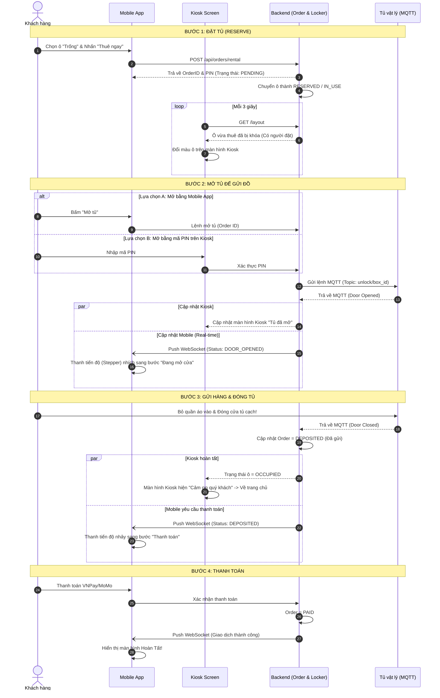

# Quy trình Thuê tủ & Gửi hàng (Đồng bộ Mobile & Kiosk)

Tài liệu này mô tả chi tiết luồng nghiệp vụ (Workflow) từ khi Khách hàng thao tác chọn tủ trên ứng dụng di động (Mobile
App) hoặc Kiosk, cho đến khi gửi đồ và hoàn tất thanh toán. Đặc biệt tập trung vào **cơ chế đồng bộ thời gian thực (
Real-time Sync)** giữa 3 thành phần: Mobile App - Backend - Kiosk.

---

## Cơ chế đồng bộ (Real-time Sync)

Hệ thống đảm bảo tính đồng bộ tức thì giữa Mobile và Kiosk bằng các công nghệ:

1. **Kiosk Screen:** Sử dụng cơ chế **Short Polling** (cứ 3 giây gọi API `getLockerLayout` một lần) để cập nhật trạng
   thái các ô tủ liên tục lên màn hình.
2. **Mobile App:** Lắng nghe tín hiệu từ Backend thông qua **WebSocket (STOMP)**. Khi tủ vật lý có thay đổi (mở cửa/đóng
   cửa), Backend sẽ push message realtime về điện thoại.
3. **IoT Hardware:** Tủ vật lý giao tiếp 2 chiều với Backend qua giao thức **MQTT**.

---

## Sơ đồ Sequence: Quy trình Thuê & Mở tủ

Quy trình dưới đây mô tả kịch bản Khách hàng **đặt tủ trên Mobile** và **ra trước Kiosk để mở tủ gửi đồ**.

---

## Chi tiết các thao tác đồng bộ

### 1. Đồng bộ khi Chọn / Đặt tủ

- **Thao tác Mobile:** Khách hàng thấy ô số #3 (Trống). Nhấn chọn và bấm **Xác nhận thuê**.
- **Đồng bộ:** Dưới Backend, ô số #3 bị khóa lại. Kiosk ngoài đời thực đang đếm lùi chu kỳ 3 giây, ngay lập tức nó fetch
  được layout mới và chuyển ô số #3 từ màu Trống sang **Đã đặt (Reserved)** hoặc **Có đồ (Occupied)**, chặn mọi người
  khác thao tác vào ô này trên Kiosk.

### 2. Đồng bộ khi Mở tủ

Khách hàng có thể linh hoạt dùng **Điện thoại** HOẶC bấm **Kiosk** để mở. Hệ thống không quan tâm luồng nào kích hoạt,
chỉ quan tâm tủ vật lý báo về:

- Nếu khách nhập PIN ở Kiosk: Cửa vật lý mở -> MQTT báo về Backend -> Backend bắn thông báo (Push Notification / STOMP
  WebSocket) xuống điện thoại khách -> **Thanh Stepper ở màn hình Mobile tự động nhảy sang bước "Cửa đang mở"** mà khách
  không cần chạm vào điện thoại.
- Ngược lại, nếu khách đứng xa và bấm "Mở tủ" trên app: Cửa bật ra -> Kiosk tự động nhảy sang màn hình hướng dẫn "Vui
  lòng cho đồ vào tủ số #3".

### 3. Đồng bộ khi Đóng cửa tủ & Thanh toán

- Kiosk và Điện thoại đều ở trạng thái "Chờ khách bỏ đồ vào".
- Khách hàng đẩy cửa tủ vật lý đóng lại. Cảm biến cửa tủ IoT ghi nhận và gửi MQTT `CLOSED`.
- Backend tự động hiểu khách đã bỏ đồ xong, chốt đơn hàng sang trạng thái `DEPOSITED`.
- **Kiosk:** Không có chức năng thanh toán tại tủ, Kiosk sẽ hiển thị "Đã nhận đồ, vui lòng thanh toán trên ứng dụng" rồi
  tự động quay về màn hình chờ (Home).
- **Mobile:** App nhận được tín hiệu WebSocket, Stepper tự động trượt qua màn hình Thanh toán (Checkout). Khách chọn ví
  VNPay/MoMo và trả tiền. Sau khi thanh toán xong, hệ thống chốt Order và tạo Job cho máy bay Drone (nếu có).

> [!TIP]
> Việc ứng dụng kết hợp cả 2 hình thức: **WebSocket (Push)** cho Mobile (để có trải nghiệm Realtime mượt mà, ít tốn pin)
> và **Polling** cho Kiosk (để đơn giản hóa thiết bị màn hình tại chỗ) giúp hệ thống luôn đồng bộ trạng thái một cách
> chuẩn xác nhất, không lo bị nghẽn mạng!
